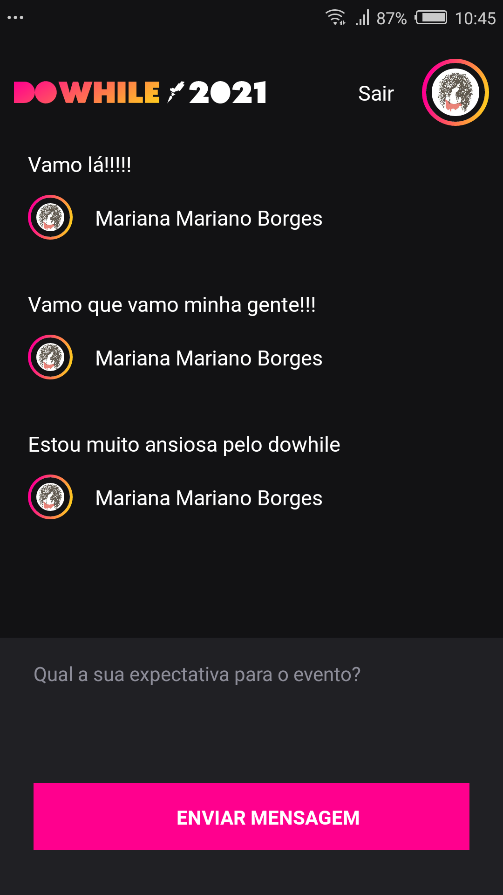

# mobileHeat
App mobile de envio de mensagens desenvolvido durante a NLW heat 

<p>
  
</p>

### Pré-requisitos

Antes de começar, você vai precisar ter instalado em sua máquina as seguintes ferramentas:
[expo](https://docs.expo.io/), [Node.js](https://nodejs.org/en/). 

### Rodando o app

```bash
# Clone este repositório
$ git clone <https://github.com/MarianaBorges/mobileHeat.git>

# Acesse a pasta do projeto no terminal/cmd
$ cd mobileHeat

# Instale as dependências
$ npm install

# Execute a aplicação
$ yarn start

# O servidor inciará na porta:19000

# Abra o expo go e leia o QR code que aparece na tela ou rode o emulador
```

### Tecnologias

As seguintes ferramentas foram usadas na construção do projeto:

- [Expo](https://expo.io/)
- [Node.js](https://nodejs.org/en/)
- [React Native](https://reactnative.dev/)
- [TypeScript](https://www.typescriptlang.org/)
